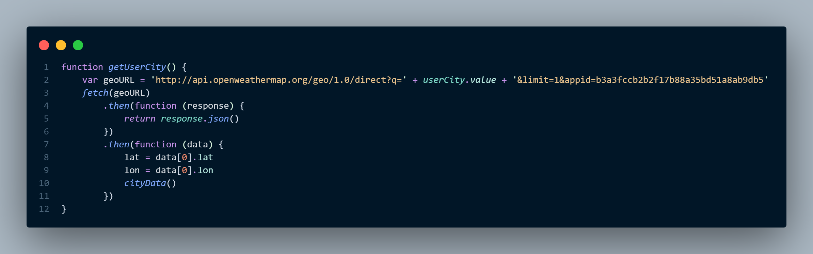
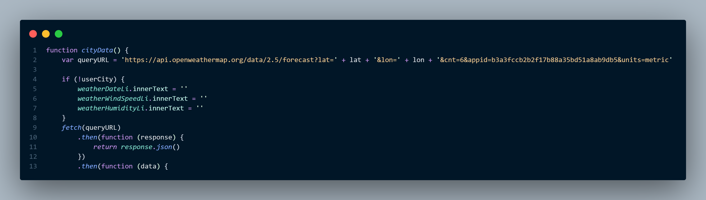

# weather-dashboard

Deployed link - https://greenie115.github.io/Weather-dashboard/

## Installation

There is no installation required for the app

## Usage

The app first fetches the user-chosen city and puts that into the GEO API so we can retrieve the latitude and longitude of that location. 

Once this is fetched, we pull the data from the API and append this to the relevant forecast cards on the screen. 

## Contributing

Pull requests are welcome. For major changes, please open an issue first
to discuss what you would like to change.

Please make sure to update tests as appropriate.

## License

[MIT](https://choosealicense.com/licenses/mit/)